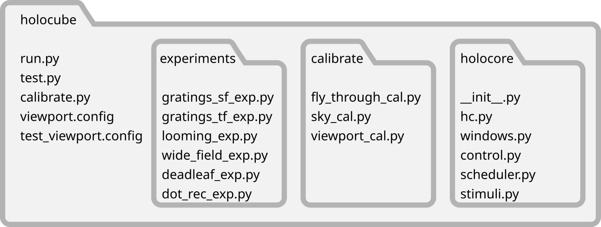

# Holocube

Holocube is a python module to display arbitrary, perspective-corrected, 
rapidly updating visual scenes. We have developed it primarily for behavior 
experiments in back-projection flight arenas (Fig. 1), but use it now in 
many other situations. It allows you to coordinate 3-dimensional immersive 
displays, precisely timed visual stimuli, closed loop visual feedback, and 
probably more things we haven’t thought of.


Figure 1. : (A) the holocube software displays a moving dot field onto a 
back-projection flight arena, (B) so an insect tethered in the center views 
perspective-corrected optic flow.

## Some terms here have specific meanings
Opengl is a programming interface for interacting with your computer’s GPU, 
which we can access with python. Some important terms from opengl are 
**screen**, which refers to the physical display device, such as a computer 
screen or a projector, and **window**, which is the rectangle that opengl is 
rendering in. The window can take the whole screen, such as when we use the 
projector, or part of it, such as when we test a script on a laptop. A 
**viewport** is a rectangular area of the window that renders a view from a 
hypothetical camera in the virtual world, such as the projection onto the 
left facing side of the holocube arena (Fig. 2). So **screen**, **window**, 
and **viewport** are standard terms in opengl, and all of them are set up in 
the configuration file.

Figure 2. In opengl, screens, windows and viewports are different things.

For the holocube software, I settled on some terms that are somewhat 
arbitrary just to keep track of what different parts of a stimulus mean. I 
usually display a series of visual scenes that vary in some way, like a 
sinusoidal grating that, with each subsequent viewing, shows a different 
spacing between the bars, or a moving field of dots that shows progressively 
more dots with each appearance. The goal is usually to change one variable 
and check for behavioral differences, like strength of steering responses. I 
call a series of visual stimuli an **experiment**, and a single experiment 
is usually coded with a python script in a single file. Each of the 
presentations in an experiment, like the dot field with 200 dots/steradian, 
or the one with 100 dots/steradian, is called a **test**. In between tests 
we often display something else, like a vertical bar that responds to 
steering feedback in closed loop, and this presentation is called a **rest** 
(a rest can display nothing, if you like). A presentation of all the 
different tests, interrupted by the rests, constitute a **trial** of an 
experiment. We often use just one fly per trial (we don't rep flies), 
meaning that one trial corresponds to a single fly responding to all the 
tests in an experiment.  The rest is actually optional, and multiple tests 
are also optional---an experiment can be made of only a single test, if you 
like. So, **experiment**, **test**, **rest**, and **trial**, we use in a 
specific way just for this software, which you need to know in order to 
write experiment scripts.

## Files follow a simple structure

Holocube experiments can run from any folder as long as it contains a run 
script, a configuration file, a folder with the experiment scripts, and a 
folder with the holocube module. The run script, `run.py`, is what you 
actually execute to start the display and experiments. It needs to import holocube from the 
holocube folder, read a configuration file from `viewport.config`, and read
the experiment scripts you’ve written from `experiments` (Fig 3). Most of the 
names can be changed, and you can have multiple run scripts or configuration 
files to control different experimental setups. You will also add and delete 
experiment scripts, or use a set of experiment folders, to control which 
experiments are available when you run holocube.

One small note is that when you first run python files they generate 
bytecode, a process that only needs to happen the first time they are run. 
To avoid redoing this step, python generates bytecode files, which have the 
extension `.pyc`. So after you successfully run holocube, there will be more 
files with similar names in your directories, such as `windows.py` and `windows.pyc`. These are all taken care of automatically, so you never need to worry 
about them. If they are accidentally deleted, they will simply be remade on 
the next run.


## the run script is short
```
#! /usr/bin/env python
import pyglet
import holocore.hc as hc

hc.control.start()
hc.window.start(config_file='test_viewport.config')
hc.scheduler.start(hc.window, hc.control,
                   randomize=False, default_rest_time=.1)
hc.scheduler.load_dir('experiments', suffix=('exp.py', 'rest.py'))
print('ready')

pyglet.app.run()
```

Holocube is launched with a run script, usually named 'run.py', but it could be named anything at
all. It has only a few essential lines of code. The first line, with #! (called shebang) looks like a
comment, and it is a comment from python’s point of view, but when executing a script without
knowing the language, this first line details which command to use (the default python, in this
case). So leave this as the first line of the script. It won’t matter if you run it right from python,
but if you want to run by double-clicking, this has to be in place.

### Imports
First we `import pyglet`, which allows python to interact with the GPU, and 
the `holocube` module itself, which I always abbreviate as `hc`:

```
import pyglet
import holocore.hc as hc
```

Now we can use the hc. prefix to reference all the functions and objects the 
module created.

### Window and control
`hc` initializes a few different objects (`control`, `window`, and
`scheduler`), which we now need to start running by calling their
.start methods. We start the control window, which displays buttons
and accepts keystroke commands, then the display, which requires the
name of a config file. This file only needs to be generated once,
usually by running the config scripts when you build a new arena. I’ll
cover the config file generation separately, but the file is specific
to a display, and you don't need to redo it unless you move something
or bump the projector.

```
hc.control.start()
hc.window.start(config_file='viewport.config')```
```

### Scheduler

Then start the scheduler, which manages all the tests of all the experiments,
frame by frame to send each to the window display manager. The only 
parameter it actually needs is the window it  will control, `hc.window`. The 
others are optional, such as whether the order of tests in an  experiment 
will be random, how long is the rest time between tests if the experiment 
script  doesn't specify (irrelevant if it does specify). 

```
hc.scheduler.start (hc.window, randomize=True, default_rest_time=.1)
```
Everything will work now, but there are no experiments to run. To load 
experiments we execute the scheduler function `.load_dir` and specify the 
directory that has experiments in it (`experiments`, `tests`, `my_experiments`...).
Normally, we specify experiment files by ending  them with `exp.py`,such as 
`spatial_grating_exp.py`, or `dot_flow_speeds_exp.py`, but really we
can use any ending we want, if we specify it here as the suffix parameter. 
If you choose something besides `exp.py`, such as `test.py`, the scheduler
will only load scripts that end with that suffix. We can also specify rest
scripts that play when no experiment is running, between experiments or 
between the tests of an experiment doesn't specify its own rest script. The
default suffix is 'rest.py'. If you want to use the defaults, you can omit 
all the arguments.
```
hc.scheduler.load_dir('experiments', suffix=('exp.py', 'rest.py'))
```

### Running it all
You can do other things, (I usually print('ready'), so I know the experiments have loaded),
but that is all the setup required. To actually set it all in motion, the last line of the run script is:
```
pyglet.app.run()
```

## An experiment script: moving dots
The run script is only useful if there is something in the experiments directory. 
One of the points of this program was to keep all the utility of python while 
coding visual displays. Let's walk through the experiment script `wide_field_exp.py`.
It begins by importing holocore and numpy. 
```
import holocore.hc as hc
import numpy as np
```
`holocore` starts the main and control windows, and the scheduler, and gives you 
access to the stimuli and other tools. `numpy` is useful for controlling the 
behavior of your stimuli.

Then we set some variables:
```
# frames in a test
num_frames = 360
# motion cycles in a test
num_cycles = 6

# magnitude of translational and rotational motions
t_magnitude = 1
r_magnitude = 30
```
`num_frames` The number of frames is the most important---it determines the frames displayed 
for each test. In actuality, tests can be different lengths, but I rarely need 
that, so I declare `num_frames` up top. The others are parameters you can tweak.

### Create a stimulus object
Next is the actual stimulus to display, and its behavior. `pts` is now a `Points` 
object from the stim module. It takes a number of point (1000 here) and an 'extent',
which is the radius of the sphere through which they are randomly distributed.
```
# declare the stimulus, a field of points
pts = hc.stim.Points(hc.window, 1000, extent=5)
# and how to move it in translation
trans_motion = t_magnitude*np.sin(np.linspace(0,num_cycles*2*np.pi, num_frames))
rot_motion = r_magnitude*np.sin(np.linspace(0,num_cycles*2*np.pi, num_frames))
```
After this are the frame by frame motions the points will travel along in our 
experiment. This is when it's handy to have numpy, as we can simply get 
sinusoidal sequences of positions.

### Tell the scheduler it has a new experiment 
The next section of code gives commands to execute at the start and end of 
the whole experiment, then adds the experiment, with these lists to the 
scheduler, which will now wait to add tests to it.
```
exp_starts = [
    [hc.window.set_far, 3],
    [hc.window.set_bg, [0.1, 0.1, 0.1, 1.0]],
    [pts.switch, True],
    ]
# reset to black background when experiment is done, turn off points
exp_ends = [[hc.window.set_far, 1],
         [hc.window.set_bg, [0.0, 0.0, 0.0, 1.0]],
         [pts.switch, False]
         ]
# add the exp
hc.scheduler.add_exp(starts=exp_starts, ends=exp_ends)
```
Commands are in the form of a list, with each entry as a command name 
followed by its arguments. So, the list `exp_starts` begins with the entry
`[hc.window.set_far, 3]`. This is a command to the window, and how distantly 
it will render points. A value of 3, in arbitrary units, is below size of the 
point sphere, which had a radius of 5. We also set the background color, and
turn on the points. Finally, we add the experiment to the scheduler with these
lists. The scheduler executes each command once, starts before the experiment
begins, and ends when it is complete or canceled.

### Add each test to the experiment
Finally, we add the tests which make up the segments of the experiment. These
actually do things. 
```# now add each test (without a for loop)
starts = []
ends = []

middles = [[pts.set_px, trans_motion]]
hc.scheduler.add_test(num_frames, starts, middles, ends)
```
Adding a test to the scheduler requires 4 arguments, the number of frames it 
will display, and lists of commands for the start, middle, and end of the test.
The `starts` and `ends` lists work just like the experiment starts and ends, but
at the beginning and end of each test---they are executed in frame 0 of the test. 

The middles however, execute in every frame through the test. In this example we 
have no commands for the start and end frames, and just one, `pts.set_px`, for 
the middles. This sets the x (left and right) position of the point field. The
argument to this is our `trans_motion` array, set earlier. If the argument were
a number or a string, that value would be applied for each frame. But in the 
case of a numpy array, holocube will use the sequential entries of the array
for the arguments---the first entry as the argument to the first frame, the 
second for the second, and so on, repeating if necessary.

The last part of this code adds the test to the experiment, then adds 5 more
tests, each with a different command in the `middles` list, with points moving 
side to side, up and down, then forward and back, then  rotating in pitch, yaw, 
and roll. When run, they will each present either in the order we added them 
here, or a random order, depending on the run script.

And that's a simple experiment script. When this file sits in the `experiments` 
folder, and is saved with the proper suffix (usually 'exp.py), it will load
and become available to run.

## Another example, drifting sinusoidal gratings with timing dots
A slightly more nuanced example is the spatial frequency grating experiment. This 
presents a series of drifting sinusoidal grating in front of the viewer, moving 
left then right, and running over a range of frequencies. This is only accurate 
if you calibrated the viewports correctly, and the viewer is the right distance
from the screen, and you render the grating at a distance of 1 in the virtual 
world. If you set the temporal frequency to 0, and put it on screen for a long 
interval, you can measure it to make sure. 

This experiment also includes the useful addition of a timing dots object, a 
visual structure you can display on a separate screen, or an unimportant location,
that displays flashing dots. If you monitor the experiment with a camera, or 
a photodiode, this can give the precise times for the start and end of tests, or 
the onset of a stimulus event, or the number of the current test.

### set the grating parameters
After the usual imports and frame constants, we set up descriptions of the 
gratings:
```
# inverted sfs, how many degrees for a cycle (assuming a square will
# cover 90 degrees). These are good frequencies for a fruit fly.
isfs = np.array([10, 12, 15, 20, 25, 32, 40, 50, 65, 80.])*np.pi/180
# sf, cycles/degree
sfs = 1./isfs
# one tf in Hz. Stripes should pass a point at this rate
tf = 1.
contrast = 1.
# test left and right
orientations = [0, 180]

sd = 0.25
pos = [0,0,-1]
iori = [0,0,1]
```
First we choose spatial frequencies, which is a bit simpler if we begin with the
spatial periods (deg/cycle), then invert them to get the frequencies (cycles/deg).
We'll only use one temporal frequency, and one contrast, so we define those, but 
we'll show 2 different orientations of the grating, meaning it will drift one way,
then the other. You could make any one of these a list, and combine all variants
in all ways. `sd` is the standard deviation, in radians, of the gaussian window
that shows the grating---you don't have to use this. `pos` is the point in 
virtual space to put this grating. It can be anywhere, but the frequencies are
only correct if the viewport calibrations are right, the virtual viewer position
is at (0,0,0), the viewer is the correct  distance from the screen, and the 
absolute distance of grating in virtual space is 1. If any of these is not true,
you'll have to measure the grating and calibrate. Probably you should do that 
anyway. `iori` is direction the grating faces, in this case opposite of its 
position, or back to the viewer. A note about openGL is that the default is for `x`
to refer to left and right, `y` up and down, and `z` is in and out of the screen, 
with the initial view being along the negative `z` direction.

### Make the gratings
```commandline
# this list will hold all the
gratings = []
# We use nested loops to generate gratings at each spatial frequency,
# and each of those at each orientation
for sf in sfs:
    for orientation in orientations:
        grating = hc.stim.Grating(hc.window, rate=frame_rate,
                                  sf=sf, tf=tf, c=contrast, o=orientation,
                                  sd=sd, init_pos=pos, init_ori=iori, edge_size=2,
                                )
        gratings.append(grating)
```
Now we make a series of grating stimuli, each with a different spatial frequency
and drift orientation. First, we declare an empty list to add them to, then we
use nested loops to generate each combination of spatial frequency and orientation.
`hc.stim.Grating` takes the arguments shown, and some more in the documentation. 
Then we just append it to our experiment list.

### Timing is everything
```commandline
td = hc.stim.Timing_Dots(hc.window, 2, side_len=.3, dot_side=.05, pos=(-1,-0.5,-0.5), ori=(1,0,0))
```
Timing dots are squares that flash to a new color in a given frame. You can 
experiment with the parameters, but they provide a way to record, with a 
camera or photodiode, on which frame some event occurred. By turing the dots
from black to white, for example, when a test begins, you can monitor other 
changes relative to this. Here we are setting a square with 2 addresable dots.
It's best if they are displayed somewhere the subject can't see.

### Starting up
```commandline
estarts = [[hc.window.set_far, 2],
           [hc.window.reset_pos_rot],
           [hc.window.set_bg, [0.5, 0.5, 0.5, 1.0]],
           [td.switch, True],
           ]

eends = [[hc.window.set_far, 5],
         [hc.window.set_bg, [0.0, 0.0, 0.0, 1.0]],
         [td.switch, False],
         ]
hc.scheduler.add_exp(starts=estarts, ends=eends)
```
We make the experiment starts and ends in the same way as before, this time 
turning on the dots, but not the gratings.

### Adding the tests
```commandline
for test_ind, grating in enumerate(gratings):
    # here we generate the flashes for the timing dots structure
    # this one signals the beginning and end of the test
    test_ends_flashes = hc.tools.test_ends_flash(num_frames)
    # this one signals the number, starting with 1, in the order
    # we added them. Be careful that you have enough frames to
    # display all the flashes
    test_num_flashes = hc.tools.test_num_flash(num_frames, test_ind+1)

    # turn on the correct grating
    starts = [
            [grating.switch, True],
              ]

    # flash the dots
    middles = [
        [td.flash, 1, test_ends_flashes],
        [td.flash, 2, test_num_flashes],
        ]

    # turn off the current grating
    ends = [
        [grating.switch, False],
        ]

    # add the test
    hc.scheduler.add_test(num_frames, starts, middles, ends)
```
Finally, we add the tests by iterating over the list of gratings we made before.
The `start` and `end` lists just switch on the correct grating, which then plays
automatically. The `middle` commands control the dots with sequences we created
via `hc.tools` functions. `test_ends_flashes` gets assigned to 
`hc.tools.test_ends_flash(num_frames)`, which just creates a sequence that marks
the start and end of the num_frames, and `test_num_flashes` gets 
`hc.tools.test_num_flash(num_frames, test_ind+1)`, which flashes depending on 
which test this is---once for the first test, twice for the second, and so on.
These get fed, in the `middles` list, to `td` the timing dots, slots 1 and 2. As 
a result, the dots flash, one dot marks the start and end of the test, and 
the other flashes out which test is running. Together this information lets you
know which grating is running and when.

### Take a rest
```commandline
# add a blank rest screen. starts, middles and ends are all empty
hc.scheduler.add_rest(num_rest_frames, [], [], [])
```
The other addition from the first sample script is a rest, which plays between 
each test. All the arguments are empty lists, so the rest gives to visual stimulation,
other than the timing dots that are already turned on. It's just a pause.

## Calibration
You can run experiments with the test script and they will appear all on the 
primary monitor. But to run them on another monitor, a projector, or LED panels,
you will need to set up the viewports properly. The `calibrate.py` run script
is for this purpose. With it you can move the locations of the viewports, their 
sizes, and their camera views. Sometimes this is more conveniently done by editing
the text file itself, but in other cases the calibrate script makes it much 
easier.


It can output a `viewport.config` file that is later 
referenced in you `run.py` script. 
