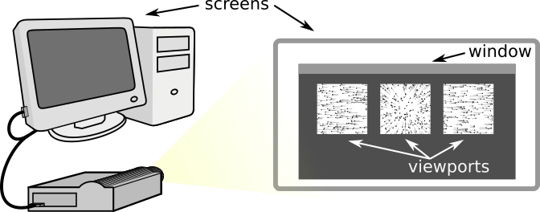

# Holocube

Holocube is a python module to display arbitrary, perspective-corrected, 
rapidly updating visual scenes. We have developed it primarily for behavior 
experiments in back-projection flight arenas (Fig. 1), but use it now in 
many other situations. It allows you to coordinate 3-dimensional immersive 
displays, precisely timed visual stimuli, closed loop visual feedback, and 
probably more things we haven’t thought of.


Figure 1. : (A) the holocube software displays a moving dot field onto a 
back-projection flight arena, (B) so an insect tethered in the center views 
perspective-corrected optic flow.

## Some terms here have specific meanings
Opengl is a programming interface for interacting with your computer’s GPU, 
which we can access with python. Some important terms from opengl are 
**screen**, which refers to the physical display device, such as a computer 
screen or a projector, and **window**, which is the rectangle that opengl is 
rendering in. The window can take the whole screen, such as when we use the 
projector, or part of it, such as when we test a script on a laptop. A 
**viewport** is a rectangular area of the window that renders a view from a 
hypothetical camera in the virtual world, such as the projection onto the 
left facing side of the holocube arena (Fig. 2). So **screen**, **window**, 
and **viewport** are standard terms in opengl, and all of them are set up in 
the configuration file.

Figure 2. In opengl, screens, windows and viewports are different things.

For the holocube software, I settled on some terms that are somewhat 
arbitrary just to keep track of what different parts of a stimulus mean. I 
usually display a series of visual scenes that vary in some way, like a 
sinusoidal grating that, with each subsequent viewing, show a different 
spacing between the bars, or a moving field of dots that shows progressively 
more dots with each appearance. The goal is usually to change one variable 
and check for behavioral differences, like strength of steering responses. I 
call a series of visual stimuli an **experiment**, and a single experiment 
is usually coded with a python script in a single file. Each of the 
presentations in an experiment, like the dot field with 200 dots/steradian, 
or the one with 100 dots/steradian, is called a **test**. In between tests 
we often display something else, like a vertical bar that responds to 
steering feedback in closed loop, and this presentation is called a **rest** 
(a rest can display nothing, if you like). A presentation of all the 
different tests, interrupted by the rests, constitute a **trial** of an 
experiment. We often use just one fly per trial (we don't rep flies), 
meaning that one trial corresponds to a single fly responding to all the 
tests in an experiment.  The rest is actually optional, and multiple tests 
are also optional---an experiment can be made of only a single test, if you 
like. So, **experiment**, **test**, **rest**, and **trial**, we use in a 
specific way just for this software, which you need to know in order to 
write experiment scripts.

## Files follow a simple structure

Holocube experiments can run from any folder as long as it contains a run 
script, a configuration file, a folder with the experiment scripts, and a 
folder with the holocube module. The run script, `run.py`, is what you 
actually execute to start the display and experiments. It needs to import holocube from the 
holocube folder, read a configuration file from `viewport.config`, and read
the experiment scripts you’ve written from `experiments` (Fig 3). Most of the 
names can be changed, and you can have multiple run scripts or configuration 
files to control different experimental setups. You will also add and delete 
experiment scripts, or use a set of experiment folders, to control which 
experiments are available when you run holocube.

One small note is that when you first run python files they generate 
bytecode, a process that only needs to happen the first time they are run. 
To avoid redoing this step, python generates bytecode files, which have the 
extension `.pyc`. So after you successfully run holocube, there will be more 
files with similar names in your directories, such as `windows.py` and `windows.pyc`. These are all taken care of automatically, so you never need to worry 
about them. If they are accidentally deleted, they will simply be remade on 
the next run.


## the run script is short
```
#! /usr/bin/env python
import pyglet
import holocore.hc as hc

hc.control.start()
hc.window.start(config_file='test_viewport.config')
hc.scheduler.start(hc.window, hc.control,
                   randomize=False, default_rest_time=.1)
hc.scheduler.load_dir('experiments', suffix=('exp.py', 'rest.py'))
print('ready')

pyglet.app.run()
```

Holocube is launched with a run script, usually named 'run.py', but it could be named anything at
all. It has only a few essential lines of code. The first line, with #! (called shebang) looks like a
comment, and it is a comment from python’s point of view, but when executing a script without
knowing the language, this first line details which command to use (the default python, in this
case). So leave this as the first line of the script. It won’t matter if you run it right from python,
but if you want to run by double clicking, this has to be in place.

### Imports
First we `import pyglet`, which allows python to interact with the GPU, and 
the `holocube` module itself, which I always abbreviate as `hc`:

```
import pyglet
import holocore.hc as hc
```

Now we can use the hc. prefix to reference all the functions and objects the 
module created.

### Window and control
`hc` initializes a few different objects (`control`, `window`, and
`scheduler`), which we now need to start running by calling their
.start methods. We start the control window, which displays buttons
and accepts keystroke commands, then the display, which requires the
name of a config file. This file only needs to be generated once,
usually by running the config scripts when you build a new arena. I’ll
cover the config file generation separately, but the file is specific
to a display, and you don't need to redo it unless you move something
or bump the projector.

```
hc.control.start()
hc.window.start(config_file='viewport.config')```
```

### Scheduler

Then start the scheduler, which manages all the tests of all the experiments,
frame by frame to send each to the window display manager. The only 
parameter it actually needs is the window it  will control, `hc.window`. The 
others are optional, such as whether the order of tests in an  experiment 
will be random, how long is the rest time between tests if the experiment 
script  doesn't specify (irrelevant if it does specify). 

```
hc.scheduler.start (hc.window, randomize=True, default_rest_time=.1)
```
Everything will work now, but there are no experiments to run. To load 
experiments we execute the scheduler function `.load_dir` and specify the 
directory that has experiments in it (`experiments`, `tests`, `my_experiments`...).
Normally, we specify experiment files by ending  them with `exp.py`,such as 
`spatial_grating_exp.py`, or `dot_flow_speeds_exp.py`, but really we
can use any ending we want, if we specify it here as the suffix parameter. 
If you choose something besides `exp.py`, such as `test.py`, the scheduler
will only load scripts that end with that suffix. We can also specify rest
scripts that play when no experiment is running, between experiments or 
between the tests of an experiment doesn't specify its own rest script. The
default suffix is 'rest.py'. If you want to use the defaults, you can omit 
all the arguments.
```
hc.scheduler.load_dir('experiments', suffix=('exp.py', 'rest.py'))
```

### Running it all
You can do other things, (I usually print('ready'), so I know the experiments have loaded),
but that is all the setup required. To actually set it all in motion, the last line of the run script is:
```
pyglet.app.run()
```
