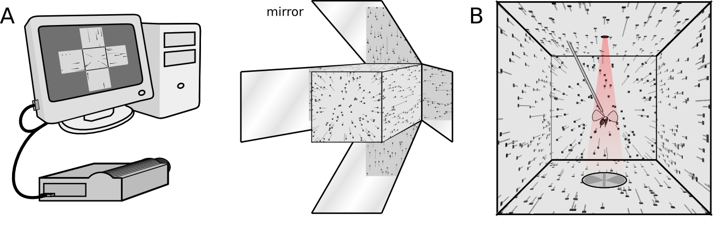

# Holocube

Holocube is a python module to display arbitrary, perspective-corrected, rapidly updating visual scenes. We have developed it primarily for behavior experiments in back-projection flight arenas (Fig. 1), but use it now in many other situations. It allows you to coordinate 3-dimensional immersive displays, precisely timed visual stimuli, closed loop visual feedback, and probably more things we haven’t thought of.

Figure 1. : (A) the holocube software displays a moving dot field onto a back-projection flight arena, (B) so an insect tethered in the center views perspective-corrected optic flow.

